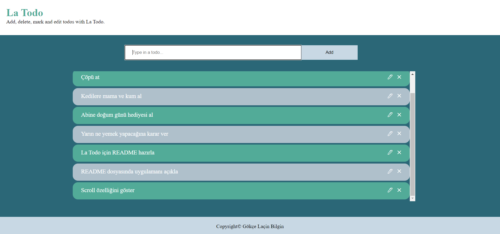
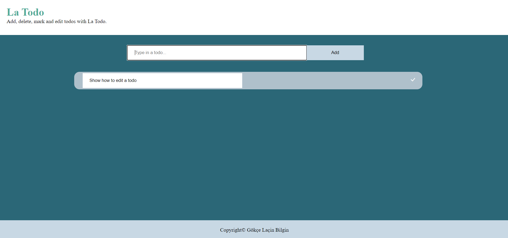

# La Todo
__La Todo__ is a web to do application with which you can add, delete and edit to dos. I designed it myself (though I did base my color choices on N26) and used Vanilla Javascript, aiming to get familiar with the language before I jump on to any frameworks.

## Functions
- Add
- Delete
- Edit

### Add
Well, the add function is pretty straigthforward: It adds to dos. You can do this by either clicking the `Add` button or by pressing Enter.

If you add more than 6 to dos, the to do list becomes scrollable.

### Delete
Once you add a todo, there are two other functions that you can utilize: Edit and __Delete__. The `Delete` button is represented by an x-shaped icon. You simply need to click it.

### Edit
The `Edit` button allows you to edit your to dos and is represented with a pen-shaped icon. When you click it, the list's appearance changes at first. Instead of the inital `Edit` and `Delete` buttons, you have a `Done` button, repsented with a tick. When you are done with editing you click the `Done` button and the list returns to its initial state.

So this was __La Todo__. I will add Mark function and Details function that shows you the creation date, due date and description of your to do in later versions. Thank you for following me on my JavaScript journey!

PS: This is the initial version of the application, the functions will not be limited to the above.